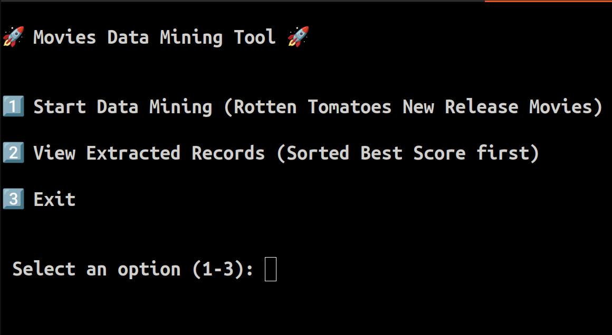
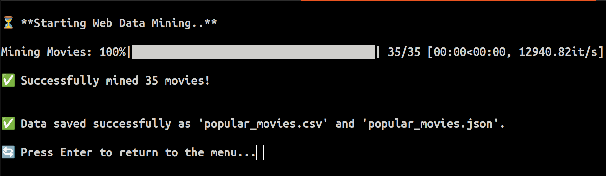
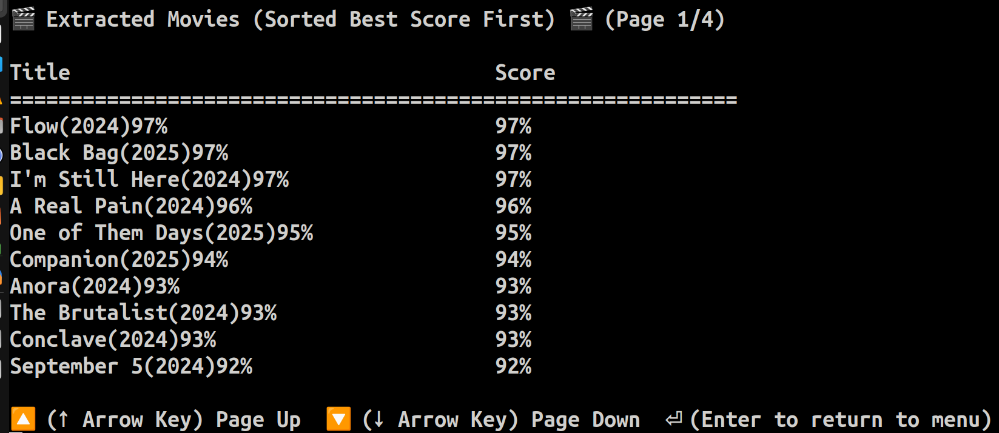

# 🎬 Movies Data Mining Tool 🎬

🔎 A **fast multi-threaded web data mining tool** that extracts a printed list of **popular new release movies** from Rotten Tomatoes.  

⚡ Built for efficiency, the tool utilizes **asynchronous web requests** and **multi-threading** to speed up data extraction.

---


## ✅ Functions
- Mines **popular new release movies** from Rotten Tomatoes 🎥

- Extracts movie **titles and ratings** 📊

- **Multi-threaded & asynchronous** for fast processing ⚡

- Saves structured data in **CSV & JSON formats** 📂

- Interactive **navigation system** for viewing results 🖥️

- Supported on **Linux, macOS, and Windows** 🏁

---

## 🛠️ Libraries and Descriptions

| Library        | Description                                           |
| :------------ | :---------------------------------------------------- |
| **`requests`**    | Handles HTTP requests efficiently.                  |
| **`aiohttp`**     | Enables asynchronous web requests for faster mining. |
| **`BeautifulSoup`** | Parses HTML for extracting movie data.             |
| **`pandas`**      | Processes and saves data in CSV/JSON formats.       |
| **`asyncio`**     | Manages asynchronous execution for speed optimization. |
| **`tqdm`**        | Provides a progress bar for better visualization.   |


---

## 📦 Installation & Setup

Follow these simple steps to get started:

1. Clone this GitHub repository
```bash
git clone https://github.com/LinuxSystemsEngineer/movies_data_mining_tool.git
```

---
2. Change directories to your newly cloned GitHub repo
```bash
cd movies_data_mining_tool
```

---
3. Create a segmented Python virtual environment 
```bash
python3 -m venv .segment
```


---
4. Activate the Virtual Environment

---
Linux or macOS:
```bash
source .segment/bin/activate
```

---
Windows:
```bash
.segment\Scripts\Activate
```

---
5. Install the requirement packages
```bash
pip3 install -r requirements.txt
```


---
6. Run the following command:
```bash
python3 main.py
```

---
7. Enjoy the program for the most popular new release movies! 🍿


---
💡 Troubleshooting:
---
Module Not Found? 

🔎 Ensure your virtual environment is activated before running the program.

🔎 Install the requirement packages from the requirements.txt file.


---
Permission Issues? 

⚠️ Try running the commands with sudo (Linux/macOS).

⚠️ Try running the commands with admin (Windows).

---

📝 License
---
This project is free and open-source software, licensed under the MIT License.

---

## 📸 Screenshots

Below are some screenshots showcasing the functionality of the **Movies Data Mining Tool**:

---

### ✅ Main Menu



---
### 📊 Data Extraction in Progress



---
### 📂 Output Data


---


